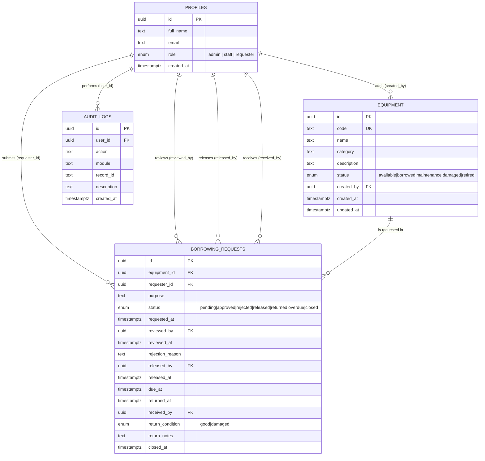
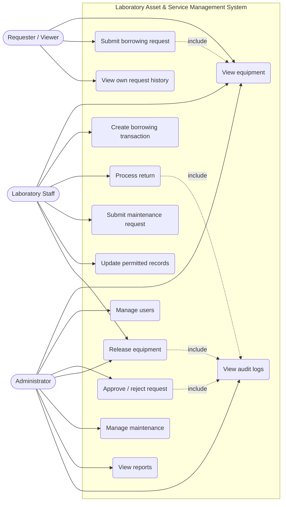

# Updated ERD and Use Case Diagram

Both diagrams are written in Mermaid, which GitHub renders automatically
when this file is viewed in the repository.

## Entity Relationship Diagram

## Use Case Diagram

