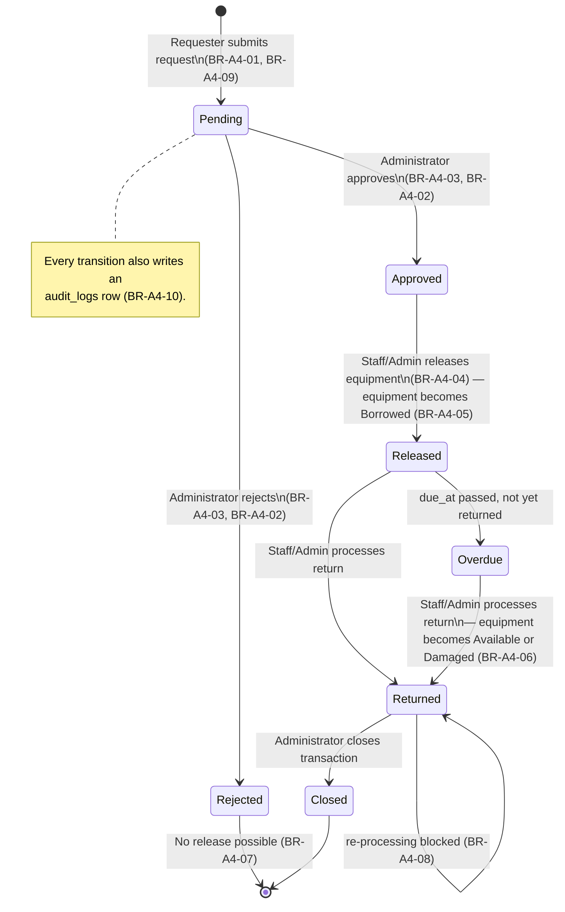
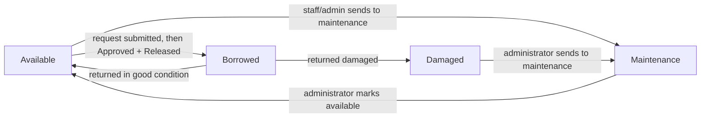

# Borrowing Approval Workflow

```mermaid
stateDiagram-v2
    [*] --> Pending : Requester submits request\n(BR-A4-01, BR-A4-09)

    Pending --> Approved : Administrator approves\n(BR-A4-03, BR-A4-02)
    Pending --> Rejected : Administrator rejects\n(BR-A4-03, BR-A4-02)

    Approved --> Released : Staff/Admin releases equipment\n(BR-A4-04) — equipment becomes Borrowed (BR-A4-05)
    Rejected --> [*] : No release possible (BR-A4-07)

    Released --> Overdue : due_at passed, not yet returned
    Released --> Returned : Staff/Admin processes return
    Overdue --> Returned : Staff/Admin processes return\n— equipment becomes Available or Damaged (BR-A4-06)

    Returned --> Closed : Administrator closes transaction
    Returned --> Returned : re-processing blocked (BR-A4-08)

    Closed --> [*]

    note right of Pending
        Every transition also writes an
        audit_logs row (BR-A4-10).
    end note
```

## Equipment status alongside the transaction

```mermaid
flowchart LR
    Available -->|request submitted, then Approved + Released| Borrowed
    Borrowed -->|returned in good condition| Available
    Borrowed -->|returned damaged| Damaged
    Available -->|staff/admin sends to maintenance| Maintenance
    Maintenance -->|administrator marks available| Available
    Damaged -->|administrator sends to maintenance| Maintenance
```
